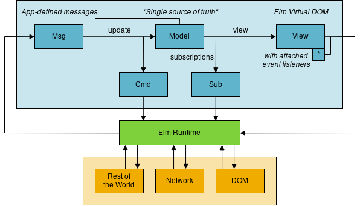

# Elm - wprowadzenie

 Arek Czogała

---
## W tej prezentacji ...

- porozmawiamy krótko ogólnie o języku Elm
- porozmawiamy o `mentalnym` podejściu do sprawy 🤯
- będą przykłady kodu :smile:
- nie powiemy o technicznych aspektach programowania funkcyjnego :zipper_mouth_face:
- nie powiemy o technicznych aspektach samego języka Elm :zipper_mouth_face:

---

## Czym jest Elm?

* język funkcyjny
* typowany statycznie z inferencją
* wszystko jest niemutowalne
* same czyste funkcje
* wyjątki `null` i `undefined` nie istnieją
* kompilacja do JavaScript

---

## Projekt - JavaScript vs Elm

| JavaScript | Elm |
|---:|---|
| npm | :white_check_mark: |
| webpack | :white_check_mark: |
| React | :white_check_mark: |
| Redux | :white_check_mark: |
| Typescript/Flow | :white_check_mark: |
| Immutable.js | :white_check_mark: |
| Virtual DOM | :white_check_mark: |

---

## Architektura Elm

* jedno słuszne podejście do struktury aplikacji
* podejście `MVU` - Model View Update

---



*https://discourse.elm-lang.org/t/image-annotation-for-the-machine-learning-community/1190/2*

---

## Kompilator Elm

* `extream pair programming buddy`  :duck:
* pliki Elm posiadają rozszerzenie `.elm`
* bardzo przyjazne komunikaty :arrow_down:

---
```
-- UNFINISHED RECORD TYPE ----------------------------------------- src/Main.elm

I was partway through parsing a record type, but I got stuck here:

4|     { firstName : String
5|     , lastName : String
6|     , completedAssignmentIds : Set Int
                                         ^
I was expecting to see a closing curly brace next. Try putting a } next and see
if that helps?

Note: I may be confused by indentation. For example, if you are trying to define
a record type across multiple lines, I recommend using this format:

    { name : String
    , age : Int
    , height : Float
    }

Notice that each line starts with some indentation. Usually two or four spaces.
This is the stylistic convention in the Elm ecosystem.
```

---

## Co nam daje Elm?

* czystą głowę
* sporą (99%) pewność że jeśli program się kompiluje to znaczy ze działa :smile:

---

## Czym jest problem?

* `Niebo jest zielone`

vs

* `Niebo jest Uncaught ReferenceError: sky is not defined`

---

## JavaScript `nie jest` językiem funkcyjnym

---

# Kodowanie na żywo :unicorn: :fire: :sunglasses:

---

## Podejście inkrementacyjne

Bardzo często spotykane. Wymieniamy kawałki aplikacji na aplikację napisaną w Elm. Ważna jest dobra enkapsulacja.

---
## Ciekawostki

* "jest dobrze trzymać wszystko w dużych plikach" - naprawdę
* nie ma komponentów! - są moduły
* refaktoryzacja kodu nigdy nie była prostsza!

---

## Linki

- strona języka - https://elm-lang.org/
- oficjalny poradnik - https://guide.elm-lang.org
- poradnik - https://elmprogramming.com
- pakiety Elm - https://package.elm-lang.org/
- piaskownica dla Elm - https://ellie-app.com
- https://sporto.github.io/elm-workshop/
- ta prezentacja - https://github.com/makeros/talks/tree/master/elm

---

# Koniec :smile:
